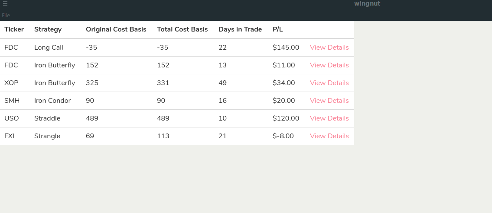
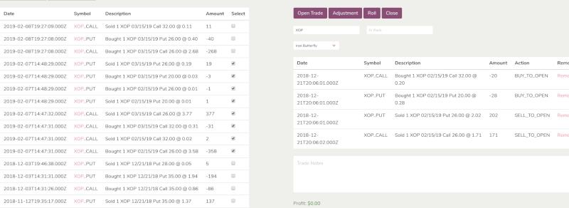

# Wingnut

Track options trades through adjustments and rolls by grouping them together. Currently supporting tastyworks CSV exports

## About Project

Using spreadsheets to track trades was getting cumbersome. This is an attempt to bring it onto a desktop application. This currently runs offline, you only need a CSV export from tastyworks and then import it into this program. For now you must manually select the transactions from your CSV export and group them into one position. This project is mostly in the proof of concept stage at the moment. This app allows you to tag each transaction as a roll or adjustment and group them all into one position so that you can see your total Credit received and P/L in a position through all rolls and adjustments

This example shows a list of closed positions that have been added to the tracker with a XOP and FXI having gone through rolls and adjustments. It shows a larger credit than the original received.

To start tagging a trade, select your original position by checking the boxes next to the transaction and click "Open Trade"

Select any other involved transactions and tag them as either Adjustment or Roll

Finally select the transactions that closed the position out and click "Close"

Select the strategy (i.e, Iron Condor, Straddle, etc), add any notes, and Save. 

## TODO
Get price quotes through an API to show realtime prices so that the current P/L can be displayed on open positions

Add support for thinkorswim CSV files
Run analysis (strategy win rates, total P/L by ticker, etc)

## Built With

* [Electron](https://electronjs.org/) - Write desktop applications  using nodejs and web based technology
* [Vue](https://vuejs.org/) - Front end framework
* [Typescript](https://www.typescriptlang.org/) - Written mostly in Typescript and also ES6 javascript
